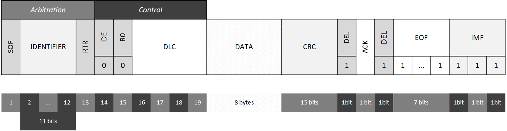

# CAN 总线

## CAN 总线的基本概念

CAN 总线是一种串行通信协议，它可以在不同的设备之间进行通信。CAN 总线的通信速率可以达到 1Mbps，它的通信距离可以达到 40m，同时它还具有很强的抗干扰能力，因此它被广泛应用于工业控制领域。

Robodyno 的硬件模组基于 CAN 2.0A 协议，使用 11 位的标准帧 ID，通信速率可以设置为 1Mbps、500kbps、250kbps。

CAN 总线标准帧的数据结构如下图所示：



* SOF：帧起始位，用于标识帧的开始。
* IDENTIFIER：帧 ID，用于标识帧的类型。
* RTR：远程传输请求位，用于标识帧的类型。
* IDE：扩展帧标识位，用于标识帧的类型。
* R0：保留位，用于标识帧的类型。
* DLC：数据长度码，用于标识帧的数据长度。
* DATA：数据域，用于存储帧的数据。
* CRC：循环冗余校验码，用于校验帧的数据。
* ACK：确认位，用于标识帧的类型。
* EOF：帧结束位，用于标识帧的结束。

## Robodyno 的帧 ID

Robodyno 的帧 ID 由 11 位组成，其中前 6 位为设备 ID，后 5 位为指令 ID。Robodyno 的设备 ID 从 0x00 到 0x3F，指令 ID 从 0x00 到 0x1F。

Robodyno 的帧 ID 的计算公式如下：

```
ID = (DEVICE_ID << 5) | COMMAND_ID
```

例如，伺服减速电机的设备 ID 为 0x10，发送心跳包的指令 ID 为 0x02，那么伺服减速电机发送心跳包的帧 ID 为 0x202。

Robodyno 保留了 0x01 的指令 ID，用于查询硬件模组的版本信息。

## Robodyno 的消息类型

Robodyno 的消息类型分为 3 种，分别是：

* 心跳包：用于检测设备是否在线。
* 读取数据：用于读取设备的数据。
* 写入数据：用于写入设备的数据。

### 心跳包

心跳包由设备主动发送，用于检测设备是否在线。你可以使用 Robodyno 的命令行工具来查看设备的心跳包：

```bash
robodyno monitor
```

也可以在 Python 中使用 Robodyno 的 CAN 总线库来订阅设备的心跳包：

```python
from robodyno.interfaces import CanBus
can_bus = CanBus()
# 订阅设备 ID 为 0x10 ，指令 ID 为 0x02 的心跳包
can_bus.subscribe(callback, 0x10, 0x02)
```

### 读取数据

读取数据需要主控发送一个 RTR 标志位为 1 的远程请求帧，然后设备会回复一个相同 ID 的数据帧，数据帧的数据域中存储了设备的数据。数据域的格式由设备的通信协议决定。

在 Python 中，你可以使用 Robodyno 的 CAN 总线库来读取设备的数据：

```python
from robodyno.interfaces import CanBus
can_bus = CanBus()
# 读取设备 ID 为 0x10 ，指令 ID 为 0x01，数据格式为 (float, half, half) 的数据
data = can_bus.get(0x10, 0x01, 'fee')
```

### 写入数据

写入数据需要主控发送一个数据帧，数据帧的数据域中存储了设备的数据。数据域的格式由设备的通信协议决定。

在 Python 中，你可以使用 Robodyno 的 CAN 总线库来写入设备的数据：

```python
from robodyno.interfaces import CanBus
can_bus = CanBus()
# 写入设备 ID 为 0x10 , 指令 ID 为 0x0e，数据格式为 (float, half, half) 的数据
can_bus.send(0x10, 0x0e, 'fee', 50, 0.02, 0.1)
```

## API

详细的 API 请查看 [CanBus](../../../references/interfaces/can_bus)。