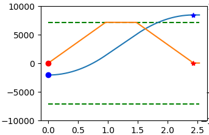
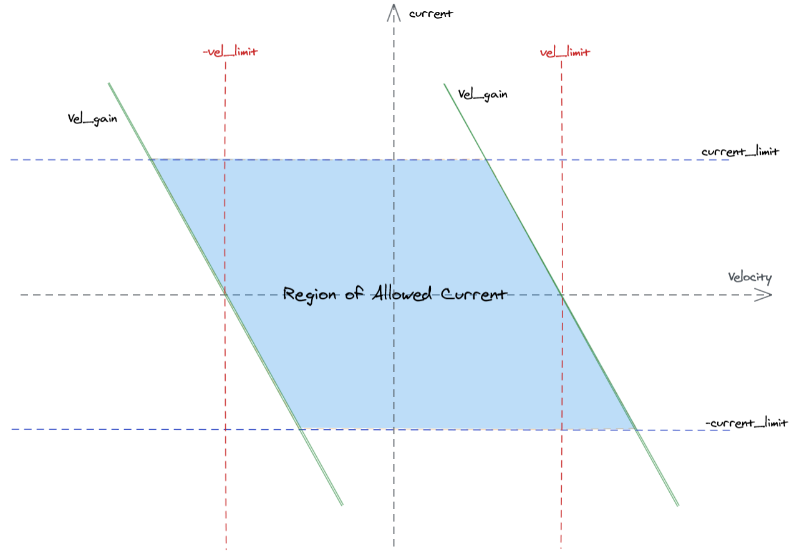

# 电机运动模式

Robodyno 伺服减速电机支持以下 6 种运动模式：

| 模式         | 说明                                                         | 参数                     |
| ------------ | ------------------------------------------------------------ | ------------------------ |
| 位置模式     | 电机按照指定的位置运动                                       |                          |
| 位置滤波模式 | 电机按照指定的位置运动，且会对位置进行滤波                   | 滤波带宽                 |
| 位置追踪模式 | 电机按照指定的位置运动，且会追踪指定的梯形速度曲线           | 最大速度、加速度、减速度 |
| 速度模式     | 电机按照指定的速度运动                                       |                          |
| 速度坡度模式 | 电机按照指定的速度运动，且会按照指定的加速度和减速度改变速度 | 加速度、减速度           |
| 力矩模式     | 电机按照指定的力矩运动                                       |                          |

在 3 种位置运动模式下，可以通过指定电机的目标位置以及前馈速度和前馈力矩来控制电机的运动。

在 2 种速度运动模式下，可以通过指定电机的目标速度以及前馈力矩来控制电机的运动。

在力矩运动模式下，可以通过指定目标力矩来控制电机的运动。

## 位置模式

位置模式下，电机会直接将指定的位置作为目标位置传入位置环 PID 控制器，控制电机转动到目标位置。

使用位置模式控制电机转动到 6.28 弧度，且前馈速度和前馈力矩分别为 0.1 rad/s 和 0.1 Nm：

=== "命令行工具"

    ``` bash
    robodyno motor pos 6.28 --vel-ff 0.1 --torque-ff 0.1
    ```

=== "Python API"

    ``` python
    from robodyno.interfaces import CanBus
    from robodyno.components import Motor

    can_bus = CanBus()
    motor = Motor(can_bus)

    motor.position_mode()
    motor.enable()
    motor.set_pos(6.28, 0.1, 0.1)
    ```

## 位置滤波模式

当直接使用位置模式以较高频率控制电机运动时，即使使用规划好的位置速度曲线，电机的实际运动也会存在抖动。为了减少抖动，可以使用位置滤波模式，该模式会对电机的位置进行滤波，从而减少抖动。

当以 1.0Hz 的带宽使用位置滤波模式控制电机从 1000rad 转动到 0rad 时，电机的实际运动曲线如下图所示：


一般滤波带宽越低，电机运动越平滑，但是响应速度也会越慢。建议将滤波带宽设置为实际发送位置指令的频率的 1/2 附近。

使用位置滤波模式以 1.0 的滤波带宽控制电机转动到 6.28 弧度：

=== "命令行工具"

    ``` bash
    robodyno motor pos 6.28 -m filter -b 1.0
    ```

=== "Python API"

    ``` python
    from robodyno.interfaces import CanBus
    from robodyno.components import Motor

    can_bus = CanBus()
    motor = Motor(can_bus)

    # 滤波带宽为 1.0Hz
    motor.position_filter_mode(bandwidth = 1.0)
    motor.enable()
    motor.set_pos(6.28)
    ```

## 位置追踪模式

位置追踪模式下，电机会按照指定的最大速度、加速度和减速度运动，且会追踪指定的梯形速度曲线，如图所示：



图中的蓝色曲线为电机的位置曲线，黄色曲线为电机的速度曲线。可以看出，电机的速度曲线是一个梯形曲线，且在加速度和减速度的限制下，电机的速度曲线会尽可能地接近指定的最大速度。

使用位置追踪模式也可以起到平滑电机运动的作用，并且可以对电机的实际运动轨迹进行更精准的预测。

使用位置追踪模式以 1.0rad/s 的最大速度、2.0rad/s^2 的加速度和减速度控制电机转动到 6.28 弧度：

=== "命令行工具"

    ``` bash
    robodyno motor pos 6.28 -m track -v 1.0 --acc 2.0 --dec 2.0
    ```

=== "Python API"

    ``` python
    from robodyno.interfaces import CanBus
    from robodyno.components import Motor

    can_bus = CanBus()
    motor = Motor(can_bus)

    # 最大速度为 1.0rad/s，加速度和减速度为 2.0rad/s^2
    motor.position_track_mode(vel = 1.0, acc = 2.0, dec =2.0)
    motor.enable()
    motor.set_pos(6.28)
    ```

## 速度模式

速度模式下，电机会直接将指定的速度作为目标速度传入速度环 PID 控制器，控制电机转动到目标速度。

使用速度模式控制电机以 1.0rad/s 的速度转动：

=== "命令行工具"

    ``` bash
    robodyno motor vel 1.0
    ```

=== "Python API"

    ``` python
    from robodyno.interfaces import CanBus
    from robodyno.components import Motor

    can_bus = CanBus()
    motor = Motor(can_bus)

    motor.velocity_mode()
    motor.enable()
    motor.set_vel(1.0)
    ```

## 速度坡度模式

速度坡度模式下，电机会以指定的速度作为目标速度，且会按照指定的坡度作为加速度和减速度改变速度。

使用速度坡度模式以 1.0rad/s 的速度、2.0rad/s^2 的速度坡度控制电机转动：

=== "命令行工具"

    ``` bash
    robodyno motor vel 1.0 -m ramp -r 2.0
    ```

=== "Python API"

    ``` python
    from robodyno.interfaces import CanBus
    from robodyno.components import Motor

    can_bus = CanBus()
    motor = Motor(can_bus)

    # 速度坡度为 2.0rad/s^2
    motor.velocity_ramp_mode(ramp = 2.0)
    motor.enable()
    motor.set_vel(1.0)
    ```

## 力矩模式

力矩模式下，电机会直接将指定的力矩作为目标力矩以一定比例传入电流环 PID 控制器，控制电机输出目标力矩。

为了安全起见，电机可以输出的最大力矩由多个因素共同决定，包括电流上限（current_limit）、速度上限（vel_limit）、当前速度（velocity）以及速度环 Kp （vel_gain），它们之间的关系如图所示：



使用力矩模式控制电机输出 0.1N·m 的力矩：

=== "命令行工具"

    ``` bash
    robodyno motor torque 0.1
    ```

=== "Python API"

    ``` python
    from robodyno.interfaces import CanBus
    from robodyno.components import Motor

    can_bus = CanBus()
    motor = Motor(can_bus)

    motor.torque_mode()
    motor.enable()
    motor.set_torque(0.1)
    ```
